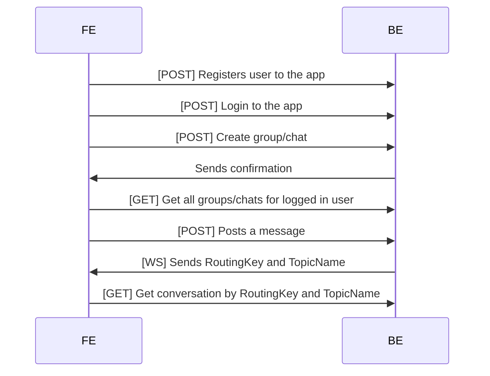

What the app has to have
* one window for chatting

For problem solving
* WireFrames
* Description of the problem (user stories, scenarios, diagrams)
* Design flaws
* Selection of technology
* Architecture design
* Proof of Concept
* Add functionality during development
* Presentation

